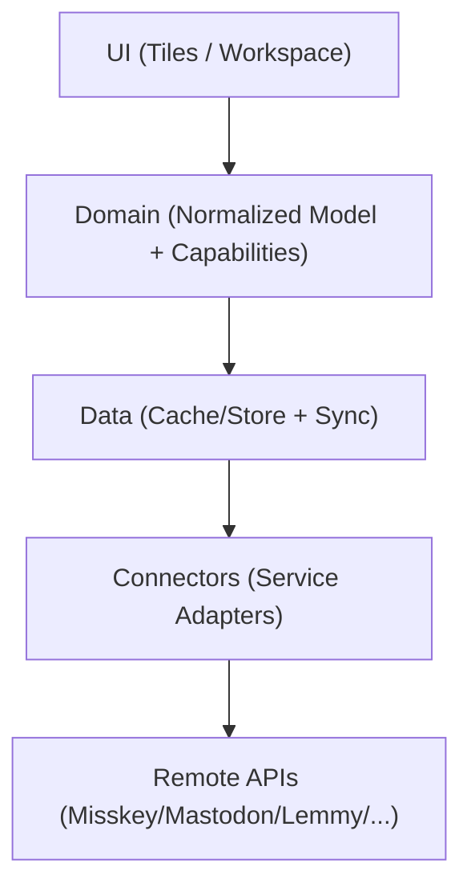

# Architecture

As a web app, we keep the UI stable and push service differences into connectors.

## Layers

### 1) UI (Tiles / Workspace)
- Workspace = a set of tiles (layout, ordering, sizing, per-tile config)
- Tile = one query (timeline/search/notifications/profile/thread, etc.)
- UI renders only the normalized model; it branches on Capabilities, not on service-specific JSON

### 2) Domain (Normalized Model + Capabilities)
- Normalize posts/notifications/profiles into a shared internal shape
- Declare “what this service/account can do” via **Capabilities** (streaming, reactions, lists, bookmarks, etc.)

### 3) Data (Cache / Sync)
- Persist into local cache (e.g. IndexedDB) and sync incrementally per tile
- De-dupe by `uri` first; fallback to `(serviceId, remoteId)`
- Track read boundary (`lastSeenAt` / `lastSeenId`) per tile

### 4) Connectors (Service Adapters)
- Absorb differences in auth (OAuth PKCE / token), paging, streaming, and domain concepts
- Return normalized types only (avoid leaking raw service JSON into UI)

## Web-specific considerations
- **CORS**: many Fediverse servers allow CORS for APIs, but not all; keep “user-hosted lightweight proxy” as a future option
- **Token storage**: browser storage has a wide attack surface; start with IndexedDB + strict content sanitization/URL policies; later consider WebCrypto-based encryption
- **Streaming**: if WebSocket/SSE is unavailable, fall back to polling
